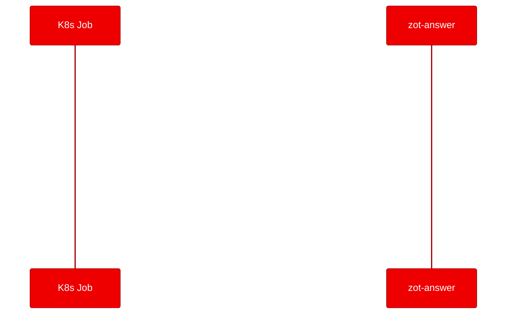

<!-- CHANGELOG — removed during finalization
v2 changes:
- Architect: Restructured opening to lead with tension, moved tool description subordinate
- Formatting: Removed all inline backticks, added redhat.com links, expanded acronyms, sentence case title
- Formatting: Added CTA links to Red Hat pages near top, mid, and closing
- Content: Added actual kubectl logs JSON output as evidence
- Content: Varied sentence structure in "What we learned" section
- Image: Added protocol sequence diagram (Mermaid)
-->

## Not every container runs a web server

When you hear "deploy to [Red Hat OpenShift](https://www.redhat.com/en/technologies/cloud-computing/openshift)," you probably picture a web application or a machine learning (ML) model behind an API endpoint. But real engineering teams also maintain command-line interface (CLI) tools, developer extensions, and protocol-based utilities that never listen on a port. Can those run on OpenShift too? And can you validate them automatically?

We took a single-file TypeScript CLI extension, containerized it with a [Universal Base Image (UBI)](https://www.redhat.com/en/blog/introducing-red-hat-universal-base-image) Node.js image, and deployed it as Kubernetes Jobs on OpenShift. Both test scenarios passed. Here's how we did it and what we learned.

## What zot-answer does

[zot-answer](https://github.com/patriceckhart/zot-answer) is a TypeScript extension for the zot terminal tool. It registers an /answer slash command that extracts numbered questions from the last assistant message and opens an interactive panel for typing answers. The extension communicates with its host through a JSON frame protocol over standard input and standard output (stdin/stdout).

The entire project is 236 lines of TypeScript, an extension.json manifest, and nothing else. No package.json, no build system, no framework.

## Containerizing with UBI Node.js

The extension has no dependency manifest. It relies on tsx (a TypeScript execution runtime) invoked through npx. We built a Dockerfile that creates a minimal package manifest inline and installs tsx as the only dependency:

```dockerfile
FROM registry.access.redhat.com/ubi9/nodejs-22

WORKDIR /opt/app-root/src

RUN echo '{"name":"zot-answer","version":"0.1.0","type":"module","dependencies":{"tsx":"^4"}}' > package.json
RUN npm install --production

COPY index.ts .
COPY extension.json .

USER 0
RUN chgrp -R 0 /opt/app-root && chmod -R g=u /opt/app-root
USER 1001

ENTRYPOINT ["npx", "tsx", "index.ts"]
```

Two details matter for [OpenShift](https://www.redhat.com/en/technologies/cloud-computing/openshift) compatibility. Files added by COPY are owned by root, and the default non-root user can't change their group. Switching to USER 0 for the permission fix, then back to USER 1001, resolves this. There's no EXPOSE directive because the extension reads from stdin and writes to stdout rather than listening on a network port.

The build ran on OpenShift using a binary BuildConfig and pushed the image to the [Quay.io](https://quay.io) container registry at quay.io/aicatalyst/zot-answer:latest.

## Deploying as Kubernetes Jobs

Since the extension exits after processing its input, a Deployment would cause CrashLoopBackOff. Kubernetes Jobs with restartPolicy set to Never match the execution model. Each Job pipes JSON frames to the container's stdin and captures the stdout.

```yaml
apiVersion: batch/v1
kind: Job
metadata:
  name: zot-answer-startup
  namespace: poc-zot-answer
spec:
  backoffLimit: 0
  activeDeadlineSeconds: 120
  template:
    spec:
      containers:
        - name: zot-answer
          image: quay.io/aicatalyst/zot-answer:latest
          command: ["/bin/sh", "-c"]
          args:
            - |
              printf '{"type":"hello_ack"}\n{"type":"shutdown"}\n' \
                | npx tsx /opt/app-root/src/index.ts
      restartPolicy: Never
```


## Proof of concept (PoC) test results

We ran two scenarios against the deployed Jobs and verified their output through kubectl logs.



**Scenario 1: protocol handshake.** The extension started, registered its command and event subscriptions, then shut down cleanly. Here's the actual output from kubectl logs:

```
{"type":"hello","name":"answer","version":"0.1.0","capabilities":["commands","events","panels"]}
{"type":"register_command","name":"answer","description":"answer the last numbered agent questions"}
{"type":"subscribe","events":["assistant_message"]}
{"type":"ready"}
[answer] connected
{"type":"shutdown_ack"}
PROCESS_EXIT=0
```

**Scenario 2: question extraction.** We sent a command_invoked frame with numbered questions. The extension responded with a command_response containing an open_panel action with the extracted question text and an answer input field.

| Scenario | Status | Duration |
|----------|--------|----------|
| Container startup | PASS | 0.2s |
| Question extraction | PASS | 0.21s |

Both scenarios confirmed that containerization preserved the extension's protocol behavior and question-extraction logic.

## What we learned

OpenShift builds expect a file named Dockerfile by default. Our initial build failed because we named the file Dockerfile.ubi. The binary build strategy looks for the standard name. We solved this by copying the file, though you could also use the --dockerfile flag on the build command.

UBI Node.js images handle minimal TypeScript projects efficiently. The ubi9/nodejs-22 image includes npm and Node.js out of the box. Adding tsx as a dependency installed 3 packages in 2 seconds with zero vulnerabilities reported.

Quay repositories default to private visibility. Our first deploy attempt hit ErrImagePull because the cluster couldn't pull from a private repository. Making the repo public via the Quay API fixed it. In production, you'd configure an image pull secret instead.

Jobs are the correct primitive for tools that exit after processing. This might seem obvious, but getting the deployment model wrong is one of the most common PoC failures we see. A stdin/stdout tool deployed as a Deployment will restart indefinitely.

## Try it yourself

The complete proof of concept artifacts are on the [autopoc-artifacts branch](https://github.com/aicatalyst-team/zot-answer/tree/autopoc-artifacts), including the PoC plan, test script, and full report.

To reproduce this deployment:
1. Fork the [repository](https://github.com/aicatalyst-team/zot-answer)
2. Build with the provided Dockerfile
3. Deploy the Kubernetes Jobs from the kubernetes/ directory
4. Check the Job logs for the JSON protocol output

If you have CLI tools or developer extensions you want to validate on [Red Hat OpenShift](https://www.redhat.com/en/technologies/cloud-computing/openshift), the pattern of containerizing with UBI images and testing with Jobs works for any stdin/stdout protocol. Get started with [OpenShift](https://developers.redhat.com/products/openshift/overview) today.
