# PoC Report: zot-answer

## 1. Executive Summary

The **zot-answer** project, a TypeScript CLI extension for the `zot` terminal tool, was evaluated as an OpenShift AI proof-of-concept. The extension was successfully containerized using a UBI Node.js 22 image, built and pushed to Quay.io, and deployed as Kubernetes Jobs on OpenShift. Both test scenarios passed, validating that the extension's JSON protocol handshake and question-extraction logic function correctly in a containerized environment. However, the project has minimal relevance to Red Hat AI strategy as it is a local CLI tool, not an AI workload.

## 2. Project Analysis

- **Repository:** `https://github.com/patriceckhart/zot-answer`
- **Fork:** `https://github.com/aicatalyst-team/zot-answer`
- **Description:** A TypeScript extension for the `zot` CLI that opens an interactive panel for answering numbered questions from the last assistant message. Communicates via JSON frames over stdin/stdout.
- **Classification:** infrastructure (CLI extension)

| Component | Language | Build System | ML Workload | Port |
|-----------|----------|-------------|-------------|------|
| zot-answer | TypeScript | npx/tsx | No | None |

- **Technologies:** TypeScript, Node.js, tsx runtime, JSON stdin/stdout protocol
- **License:** MIT
- **Stars:** 1

## 3. PoC Objectives

1. Containerize the TypeScript extension using a UBI Node.js image
2. Verify the extension can start and respond to the JSON protocol handshake
3. Validate the core question-extraction logic with sample input
4. Demonstrate the container runs successfully as a Kubernetes Job

**ODH Relevance:** Minimal. This is a developer CLI tool, not an AI/ML workload. The PoC primarily validates containerization and Kubernetes Job execution patterns.

## 4. Pipeline Execution

```mermaid
%%{init: {'theme': 'base', 'themeVariables': {'primaryColor': '#EE0000', 'primaryTextColor': '#fff', 'primaryBorderColor': '#A30000', 'lineColor': '#6A6E73', 'secondaryColor': '#F0F0F0', 'tertiaryColor': '#0066CC'}}}%%
flowchart LR
    A[Phase 1\nIntake] --> B[Phase 2\nEvaluate]
    B --> C[Phase 3\nFork]
    C --> D[Phase 4\nPoC Plan]
    D --> E[Phase 5\nContainerize]
    E --> F[Phase 6\nBuild]
    F --> G[Phase 7\nDeploy]
    G --> H[Phase 8\nApply]
    H --> I[Phase 9\nTest]
    I --> J[Phase 10\nReport]

    style A fill:#0066CC
    style B fill:#0066CC
    style C fill:#0066CC
    style D fill:#0066CC
    style E fill:#0066CC
    style F fill:#0066CC
    style G fill:#0066CC
    style H fill:#0066CC
    style I fill:#0066CC
    style J fill:#EE0000
```

- **Intake:** Single TypeScript component identified (`index.ts`), no existing Dockerfile or package.json.
- **Evaluate:** RHOAI fitness score: 6/40. Relationship: misaligned. No AI/ML relevance.
- **Fork:** Forked to `https://github.com/aicatalyst-team/zot-answer` with AutoPoC topics.
- **PoC Plan:** Classified as `infrastructure`, Job deployment model, CLI test strategy.
- **Containerize:** Generated `Dockerfile.ubi` using `registry.access.redhat.com/ubi9/nodejs-22`, installed tsx via npm, ran as USER 1001.
- **Build:** Built on OpenShift cluster (binary build), pushed to `quay.io/aicatalyst/zot-answer:latest`. Build required 3 attempts (missing Dockerfile name, permission fix for chgrp).
- **Deploy:** Generated 2 Job manifests for test scenarios (no Service needed).
- **Apply:** Jobs deployed to `poc-zot-answer` namespace. Initial ErrImagePull resolved by making Quay repo public.
- **PoC Execute:** Both scenarios passed.

## 5. Test Results

| Scenario | Status | Duration | Details |
|----------|--------|----------|---------|
| container-startup | PASS | 0.2s | Extension starts, sends hello/ready frames, responds to shutdown with ack, exits 0 |
| question-extraction | PASS | 0.21s | Extension processes command_invoked, returns command_response with open_panel action |

Both test scenarios validated successfully. The extension correctly:
- Sends the `hello` registration with capabilities
- Registers the `/answer` slash command
- Subscribes to `assistant_message` events
- Responds to `command_invoked` by extracting questions and opening a panel
- Handles `shutdown` cleanly with `shutdown_ack`

## 6. Infrastructure Deployed

- **Namespace:** `poc-zot-answer`
- **Container Image:** `quay.io/aicatalyst/zot-answer:latest`
- **Base Image:** `registry.access.redhat.com/ubi9/nodejs-22`
- **K8s Resources:**
  - `Job/zot-answer-startup` - Protocol handshake test
  - `Job/zot-answer-extraction` - Question extraction test
- **Resource Allocations:**
  - Requests: 256Mi RAM, 250m CPU
  - Limits: 512Mi RAM, 500m CPU
- **No Services or Routes** (CLI tool, no network ports)

## 7. Recommendations

### Production Readiness
- **Not applicable** for production deployment as an AI workload. This is a developer CLI extension.
- The extension functions correctly in containers but requires the `zot` host runtime for practical use.

### Observations
- The extension's stdin/stdout JSON protocol is well-designed and easily testable in containers.
- The `tsx` runtime adds minimal overhead (3 npm packages, fast startup).
- No production security concerns -- runs as non-root (USER 1001), minimal attack surface.

### Next Steps
- This project does not warrant further AI platform investment.
- If zot extensions become relevant to developer tooling strategy, the containerization pattern is proven.

## 8. Open Data Hub / OpenShift AI Considerations

This project has no relevance to ODH/OpenShift AI components:
- No model serving (ModelMesh, KServe)
- No data processing (Data Science Pipelines)
- No model training (Kubeflow Training Operator)
- No inference workload
- No LLM integration

The PoC validates basic containerization and Kubernetes Job execution patterns, which is a common requirement for any project onboarding to OpenShift.

## 9. Appendix

### Artifacts
- **PoC Plan:** `poc-plan.md` ([autopoc-artifacts branch](https://github.com/aicatalyst-team/zot-answer/blob/autopoc-artifacts/poc-plan.md))
- **Test Script:** `poc_test.py` ([autopoc-artifacts branch](https://github.com/aicatalyst-team/zot-answer/blob/autopoc-artifacts/poc_test.py))
- **Evaluation:** `.autopoc/rhoai-evaluation.md` ([autopoc-artifacts branch](https://github.com/aicatalyst-team/zot-answer/blob/autopoc-artifacts/.autopoc/rhoai-evaluation.md))
- **Dockerfile:** `Dockerfile.ubi` ([main branch](https://github.com/aicatalyst-team/zot-answer/blob/main/Dockerfile.ubi))
- **K8s Manifests:** `kubernetes/` ([main branch](https://github.com/aicatalyst-team/zot-answer/tree/main/kubernetes))

### Build Issues Encountered
1. OpenShift binary build requires `Dockerfile` (not `Dockerfile.ubi`) -- copied file as `Dockerfile`
2. `chgrp` permission error on COPY'd files -- fixed by adding `USER 0` before `chgrp` and `USER 1001` after
3. `ErrImagePull` -- resolved by making Quay repository public

### Retry Attempts
- Build: 3 attempts (2 retriable failures)
- Deploy: 1 attempt (after fixing image visibility)
- Container fix: 0
